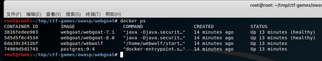

# WEB网络漏洞攻防

### 实验环境：

------

WebGoat & Juice Shop


### 实验过程：

------

1.WebGoat环境的搭建：

```
git clone http://github.com/c4prlc3/ctf-games.git
```

把老师的git clone放到目录tmp里

启动环境：


使用

```
docker ps
```

都显示healthy则说明启动环境成功。



2.进入WebGoat登录页面：


3.下载SwitchyardOmega插件，设置代理，命名burpsuite


##### 未验证的用户输入漏洞：

1.绕过html字段限制：

没有修改的时候input只能输入最多五个字符，并且修改max length，输入的长度就可以多于五个。


把burpsuite设置为

```
intercept is on
```

提交submit，可看到我们提交的被拦截了。


绕过html字段限制：对拦截到的信息字段修改，点击forward提交：


2.绕过JavaScript校验：

网页随意输入，不符合要求就会报错，用开发者工具打开源码，删除判断字符串是否合法的那串代码：


同样，输入不合法字符串点击forward即可完成绕过客户端JavaScript校验，校验成功如图：


##### XSS跨站脚本攻击：

脆弱访问控制：

输入自己的信息，可以获得密码，在user name输入admin，提交后出现密码保护问题，试了很多次发现green正确，表示攻击成功。


并且得到密码。

在邮件正文的链接中加入SessionID，确认提交后，点击弹出页面中的链接”Goat Hills Financial“，登录用户JANE：


在网址上我们的sid为 no valid IDsession,修改为我们一开始在邮件中填的内容，然后回车。


##### Injection注入缺陷

随意输个密码，使用burpsuite拦截：


拦截后修改密码，接着forward：


绕过密码登录：


#### Juice Shop攻防：

环境搭建：


SQL注入：

在用户名部分输入”or 1=1--“发现不管输入啥密码，回车后都能绕过通过。


脆弱认证：

输入Bjoern的owasp账户，密保问题是问最喜欢的宠物，通过互联网信息搜索，发现他有一只猫叫'Zaya'，尝试填入答案，并进行密码重置，回车后成功实现密码重置


##### XSS：

按照题目要求在搜索栏中输入

```
`iframe src="javascript:alert(`xss`)">
```

出现弹窗


#### 敏感数据：获取机密文件

点击下载，访问该下载路径，根据左下角的路径访问ftp链接，可发现机密文件：


##### 脆弱的访问控制

查看另一个用户的购物车，把bursuite设置为intercept is on，点击购物车，可以看到抓到的包，

```
GET/rest/basket/5 HTTP/1.1
```

把更改basket的数值，点击forward：


成功。

#### 实验感言：

已经配置好环境得重启虚拟机然后再开启docke服务。

Juice Shop很好用啊

端口号被占用，更换一个端口号即可。
