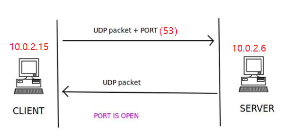

# TCP UDP网络扫描编程实践实验报告

----------


## 1.实验要求
- TCP connect scan
- TCP stealth scan
- TCP XMAS scan
- UDP scan

## 2.实验背景知识整理
- TCP connect scan
TCP连接是客户端和服务器之间的三次握手。如果发生三次握手，则建立通信。<br>1.客户端首先发送一个TCP包，包含设置为1的SYN标志和想要建立连接的端口号;<br>2.如果服务器的对应端口可用的话，服务器回应一个TCP包，包含SYN和ACK确认标志;<br>3.第三次客户端发送一个包含确认ACK的ACK标志和RST标志的包，随后连接正式建立，如果完成三次握手成功后，则服务器上的端口处于打开状态。<br>如果客户端发送第一次握手信息SYN和对应端口号，但此时服务器上的对应端口不可用，则服务器发送一个RST包来响应，那么说明这个特定的端口此时是关闭状态。

- TCP stealth scan
此技术与TCP连接十分类似。<br>1.客户端首先发送一个TCP包，包含设置好的SYN标志和想要建立连接的端口号;<br>2.如果服务器的对应端口可用的话，服务器回应一个TCP包，包含SYN和ACK确认标志;<br>3.第三次客户端发送一个包含RST的TCP包，而不是ACK+RST包，随后连接正式建立。<br>此技术用于避免防火墙检测端口扫描。
关闭端口检查与TCP连接扫描相同。服务器使用在TCP数据包内设置的RST标志进行响应，以指示服务器上的端口已关闭

- TCP XMAS scan
与前两者不同，XMAS扫描中不出现三次交互的完整过程，首先，客户端发送一个包，其中TCP头部中的PSH、FIN和URG标志位都被设置为1，包中还包含了想要建立连接的端口号，如果此时端口处于可用状态，则服务器不返回任何内容；如果此时端口处于关闭状态，那么服务器回应一个RST标志位设置为1的响应包。<br>如果服务器回复了一个ICMP数据包，错误类型是3无法访问且ICMP代码为1,2,3,9,10或13，则说明端口被过滤掉了，无法从响应中推断出端口是打开还是关闭状态。

- UDP scan
TCP是一个面向连接的协议而UDP是无连接的协议。<br>
面向连接的协议要求服务器和客户端之间的通信信道必须先空闲可用，之后才能有进一步的包发送，如果二者之间没有建立通信信道，那么就不会有通信发生。<br>
但无连接协议在发包之前无需确认服务器和客户端之间是否有通信信道，源主机直接假设目的主机可用，并将数据直接发送给目的主机。<br>
客户端给服务器发送一个包含目的端口号的UDP包，如果服务器回复了一个UDP包，那么说明这个特定的端口对客户端是开放状态；如果服务器返回了一个错误类型为3、代号为3的ICMP包，说明该端口对客户端是关闭状态；如果服务器响应了一个错误类型为3、代号为1,2,9,10或13的ICMP包，说明服务器上的该端口被过滤掉了；如果服务器没有任何响应，我们可以推断出此时端口或处于开放状态或被过滤掉了，我们不能确定端口的最终状态如何。

## 3.实验过程
- 设备环境准备<br>
扫描机（充当客户端角色）kali系统 IP地址： 10.0.2.15<br>
被扫描机（充当服务器角色）kali系统 IP地址：10.0.2.6<br>
- 端口环境准备
对于TCP连接来说，端口的状态有开启和关闭两种状态
可以用python自带的SimpleHTTPserver模块来开启TCP的80端口
```
python -m SimpleHTTPServer 80
```


<br>由于kali自带的python版本是2.7，因此可以使用上述指令直接开启端口<br>

<br>在python3中，该SimpleHTTPServer模块已合并到http.server，因此python3中的同样操作的指令语句为

```
python -m http.server 80
```
用nmap检查端口的情况，验证此时80端口处于打开状态，8080端口处于关闭状态<br>

<br>对于udp端口的开放状态，用以下几行代码来实现<br>


```
import socket
addr = "10.0.2.6"
port=input("port number:")
s=socket.socket(socket.AF_INET,socket.SOCK_DGRAM)
s.bind((addr,port))
```
用nmap检查端口的情况，验证此时67端口处于关闭状态,然而此时nmap扫描53端口的结果为open|filter<br>

<br>于是采用下面的额方法重新试图打开53端口<br>


```
nc -u -l -p 53 < /etc/passwd
```
此时再次使用nmap进行扫描<br>

<br>可见53端口已经正式开放了<br>

- 实验内容
	- TCP connect scan
<br>扫描机10.0.2.15上用python运行写好的tcp连接扫描代码，同时，被扫描机10.0.2.6上用tcpdump监听对应的网卡端口<br>
<br>

<br>可由监听结果中看出，与开放的80端口建立连接时，两台主机间有明显的三次交互过程<br>
1.10.0.2.15->10.0.2.6 [S] SYN<br>
2.10.0.2.6->10.0.2.15 [S.] SYN,ACK<br>
3.10.0.2.15->10.0.2.6 [R.] RST,ACK<br>
然而与关闭的8080端口连接时，只有两次交互过程<br>
1.10.0.2.15->10.0.2.6 [S] SYN<br>
2.10.0.2.6->10.0.2.15 [R.] RST,ACK<br>
为了更清楚的观察到包中Flag标志位的特点，我们抓包后用wireshark图形界面来分析观察<br>
<br>

<br>由此可得，实验与理论相符合。<br>
	- TCP stealth scan
扫描机10.0.2.15上用python运行写好的tcp隐形扫描代码，同时，被扫描机上用tcpdump监听对应的网卡端口<br>
<br>

<br>可由监听结果中看出，与开放的80端口建立连接时，两台主机间有明显的三次交互过程<br>
1.10.0.2.15->10.0.2.6 [S] SYN<br>
2.10.0.2.6->10.0.2.15 [S.] SYN,ACK<br>
3.10.0.2.15->10.0.2.6 [R] RST<br>
然而与关闭的8080端口连接时，只有两次交互过程<br>
1.10.0.2.15->10.0.2.6 [S] SYN<br>
2.10.0.2.6->10.0.2.15 [R.] RST,ACK<br>
为了更清楚的观察到包中Flag标志位的特点，我们抓包后用wireshark图形界面来分析观察<br>

<br>
	- TCP XMAS scan
<br>扫描机10.0.2.15上用python运行写好的tcp XMAS扫描代码，同时，被扫描机10.0.2.6上用tcpdump监听对应的网卡端口<br>
<br>

<br>可由监听结果中看出，与开放的80端口建立连接时，只有扫描机给被扫描机的发包过程<br>
1.10.0.2.15->10.0.2.6 [FPU] PSH，FIN，URG<br>
然而与关闭的8080端口连接时，有两次交互过程<br>
1.10.0.2.15->10.0.2.6 [FPU] PSH、FIN和URG<br>
2.10.0.2.6->10.0.2.15 [R.] RST,ACK<br>
为了更清楚的观察到包中Flag标志位的特点，我们抓包后用wireshark图形界面来分析观察<br>

<br>
	- UDP scan
<br>扫描机10.0.2.15上用python运行写好的udp扫描代码，同时，被扫描机10.0.2.6上用tcpdump监听对应的网卡端口（方法一打开53端口）<br>
<br>

<br>可知，此刻scapy的扫描结果显示53端口为open|filter状态，说明被扫描机没有发送任何响应包给扫描机，监听的结果与预想中一致<br>
只有10.0.2.15发送给10.0.2.6的UDP包，没有任何响应包<br>
对于关闭的67端口，可以观察到两台主机间有两次交互<br>
1.10.0.2.15->10.0.2.6 [|domain] UDP<br>
2.10.0.2.6->10.0.2.15 ICMP <br>
为了更清楚的观察到包中Flag标志位的特点，我们抓包后用wireshark图形界面来分析观察<br>

<br>
采用第二种方式打卡53端口后对该端口进行重复实验<br>
<br>

<br>这次可以观察到两台主机之间的交互<br>
1.10.0.2.15->10.0.2.6 [UDP]<br>
2.10.0.2.6->10.0.2.15 [UDP]<br>


## 4.实验代码

- TCP connect scan
```bash
import logging
logging.getLogger("scapy.runtime").setLevel(logging.ERROR)
from scapy.all import *

dst_ip = "10.0.2.6"
src_port = RandShort()
dst_port = input("Please input the port number:")

tcp_connect_scan_resp = sr1(IP(dst=dst_ip)/TCP(sport=src_port,dport=dst_port,flags="S"),timeout=10)
if(str(type(tcp_connect_scan_resp))=="<type 'NoneType'>"):
	print "Closed"
elif(tcp_connect_scan_resp.haslayer(TCP)):
	if(tcp_connect_scan_resp.getlayer(TCP).flags == 0x12):
		send_rst = sr(IP(dst=dst_ip)/TCP(sport=src_port,dport=dst_port,flags="AR"),timeout=10)
		print "Open"
	elif (tcp_connect_scan_resp.getlayer(TCP).flags == 0x14):
		print "Closed"
```

- TCP stealth scan
```bash
import logging
logging.getLogger("scapy.runtime").setLevel(logging.ERROR)
from  scapy.all  import *

dst_ip = "10.0.2.6"
src_port = RandShort()
dst_port = input("Please input the port number:")

stealth_scan_resp = sr1(IP(dst=dst_ip)/TCP(sport=src_port,dport=dst_port,flags="S"),timeout=10)
if(str(type(stealth_scan_resp))=="<type 'NoneType'>"):
	print "Filtered"
elif(stealth_scan_resp.haslayer(TCP)):
	if(stealth_scan_resp.getlayer(TCP).flags == 0x12):
		send_rst = sr(IP(dst=dst_ip)/TCP(sport=src_port,dport=dst_port,flags="R"),timeout=10)
		print "Open"
	elif (stealth_scan_resp.getlayer(TCP).flags == 0x14):
		print "Closed"
elif(stealth_scan_resp.haslayer(ICMP)):
	if(int(stealth_scan_resp.getlayer(ICMP).type)==3 and int(stealth_scan_resp.getlayer(ICMP).code) in [1,2,3,9,10,13]):
		print "Filtered"
```

- TCP XMAS scan
```bash
import logging
logging.getLogger("scapy.runtime").setLevel(logging.ERROR)
from scapy.all import *

dst_ip = "10.0.0.1"
src_port = RandShort()
dst_port= input("Please input the port number:")

xmas_scan_resp = sr1(IP(dst=dst_ip)/TCP(dport=dst_port,flags="FPU"),timeout=10)
if (str(type(xmas_scan_resp))=="<type 'NoneType'>"):
	print "Open|Filtered"
elif(xmas_scan_resp.haslayer(TCP)):
	if(xmas_scan_resp.getlayer(TCP).flags == 0x14):
		print "Closed"
	elif(xmas_scan_resp.haslayer(ICMP)):
		if(int(xmas_scan_resp.getlayer(ICMP).type)==3 and int(xmas_scan_resp.getlayer(ICMP).code) in [1,2,3,9,10,13]):
			print "Filtered"
```

- UDP scan
```bash
import logging
logging.getLogger("scapy.runtime").setLevel(logging.ERROR)
from scapy.all import *

dst_ip = "10.0.2.6"
src_port = RandShort()
dst_port = input("Please input the port number:")
dst_timeout = 20

def udp_scan(dst_ip,dst_port,dst_timeout):
	udp_scan_resp = sr1(IP(dst=dst_ip)/UDP(dport=dst_port),timeout=dst_timeout)
	if (str(type(udp_scan_resp))=="<type 'NoneType'>"):
		retrans = []
		for count in range(0,3):
			retrans.append(sr1(IP(dst=dst_ip)/UDP(dport=dst_port),timeout=dst_timeout))
		for item in retrans:
			if (str(type(item))!="<type 'NoneType'>"):
				udp_scan(dst_ip,dst_port,dst_timeout)
		return "Open|Filtered"
	elif (udp_scan_resp.haslayer(UDP) or udp_scan_resp.getlayer(IP).proto == IP_PROTOS.udp):
		return "Open"
	elif(udp_scan_resp.haslayer(ICMP)):
		if(int(udp_scan_resp.getlayer(ICMP).type)==3 and int(udp_scan_resp.getlayer(ICMP).code)==3):
			return "Closed"
		elif(int(udp_scan_resp.getlayer(ICMP).type)==3 and int(udp_scan_resp.getlayer(ICMP).code) in [1,2,9,10,13]):
			return "Filtered"

print udp_scan(dst_ip,dst_port,dst_timeout)
```


